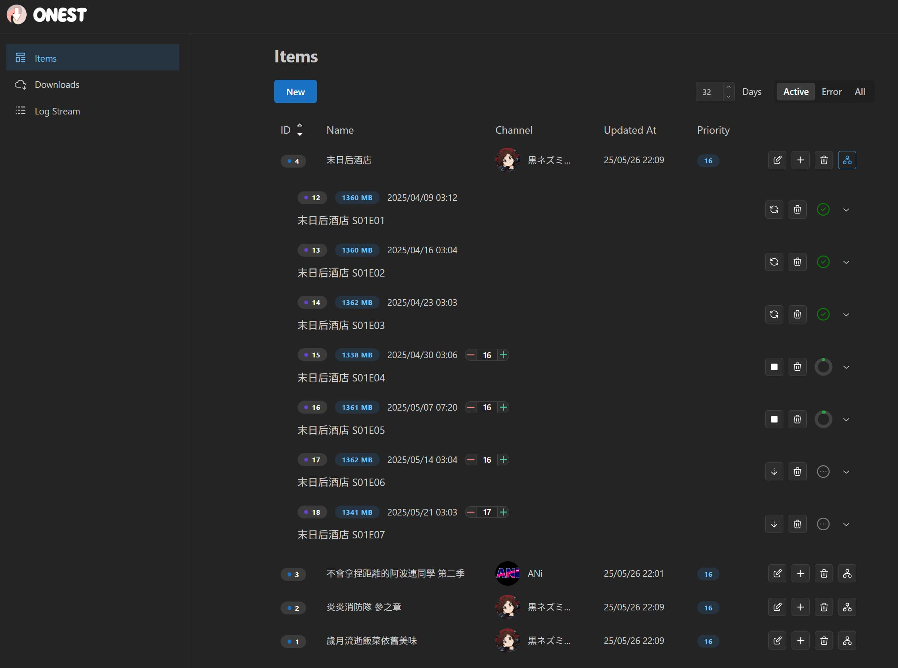

# ONEST

<div align="center">
    
    <div>
        <a href="https://goreportcard.com/report/github.com/acgn-org/onest">
            
        </a>
        <a href="https://github.com/acgn-org/onest/blob/main/LICENSE">
            
        </a>
        <a href="https://github.com/acgn-org/onest/issues">
            
        </a>
    </div>
    <div>
        <a href="https://github.com/acgn-org/onest/actions?query=workflow%3ARelease">
            
        </a>
        <a href="https://github.com/acgn-org/onest/releases">
            
        </a>
        <a href="https://hub.docker.com/r/acgn0rg/onest">
            
        </a>
    </div>
    <p></p>
    
</div>

## Get Started

Currently, we only release in the form of a Docker image, as Docker is required during the CI/CD process, which ultimately produces a Docker image. However, since the binary in the Docker image is statically linked, you can simply extract it from the image and run it anywhere.

You can find all tagged images on [Docker Hub](https://hub.docker.com/r/acgn0rg/onest).

#### 1. Minimum Prerequisites

+ You must be familiar with [regular expressions](https://golang.org/s/re2syntax).
+ Docker or other container engines.
+ A Telegram user account.
+ A pair of [Telegram apps API credencial](https://core.telegram.org/api/obtaining_api_id).
+ The user account must have already joined the relevant channels.

At present, an authentication mechanism is not provided. It is recommended to use the service within an internal network or implement authentication through a gateway.

#### 2. Minimum Configuration

The full configuration can be found [here](#full-configuration).

> config.yaml

```yaml
telegram:
    api_hash:
    api_id:
```

#### 3. Run Application

When no data is present or the login credentials are no longer valid, the container must be run using tty mode. For example, in Docker, you need to add the `-it` flags.

```bash
docker run -it --restart=always --user 1000:1000 -p 80:80 -v my_config.yaml:/data/config.yaml -v data_folder:/data acgn0rg/onest:latest
```

You can also use a command such as `docker attach` to connect to an existing, running container.

After the container starts, you will see output similar to the following:

```
[INFO] [com:source:telegram] authorizing...
Enter phone number:
```

When this content appears, enter your Telegram account information to proceed with login.

### About Adding Item

ONEST currently does not scan historical records, as it is unwise to scan hundreds of thousands or even millions of messages each time a new item is added. Therefore, you can choose to either fetch past data from Real Search, or create an empty item and then manually add previous download tasks.

#### 1. Mechanism

An item is included in the scan only if its last update occurred within the number of days specified by the `telegram.scan_threshold_days` setting in the configuration. The `match pattern` and `match content` determine whether new information belongs to the current item. Then, the `target pattern` determines the file name.

#### 2. Pattern

The `pattern` is a template string used for rendering that references output from regexp submatches.

For example, given the input string `ABCDEFGFGGG`, if you apply the regular expression `((.)B)C(.+?)F(.*)G` with the pattern `$1/$2/$3/$4`, the resulting output will be `AB/A/DE/GFGG`. Currently, we have not yet added any variables other than those derived from regexp submatches.

### Full Configuration

Environment Variables > Yaml File > Defaults

Environment variable key names consist of the `ONEST` prefix followed by subsequent fields, with all parts separated by underscores (`_`). For example: `ONEST_SERVER_PORT`.

> config.yaml

```yaml
server:
  host: '0.0.0.0'
  port: 80
  log_level: info
  log_ring_size: 500
  file_perm: '0777'
realsearch:
  base_url: https://search.acgn.es/
  timeout: 30
telegram:
  api_id:
  api_hash:
  data_folder: tdlib
  max_parallel_download: 3
  max_download_error: 5
  scan_threshold_days: 32
database:
  type: sqlite # or mysql
  db_file: server.sqlite
  host:
  port:
  user:
  password:
  database:
  ssl_mode:
```

#### Other environment variables:

|Key|Default|Desc|
|---|---|---|
|`ONEST_CONFIG`|`config.yaml`|Path of config file.|
|`ONEST_WEB_SERVER_ADDR`|`http://localhost:5173`|Address of the live frontend server; this setting only takes effect when using `Dockerfile.live`.|
|`HTTP_PROXY` / `HTTPS_PROXY`||HTTP proxy for network access.|
|`NO_PROXY`||This setting does not take effect for the Telegram apps API.|
